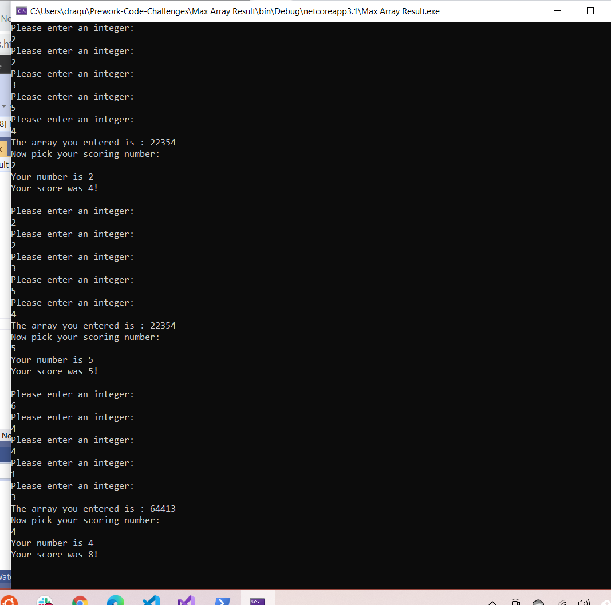
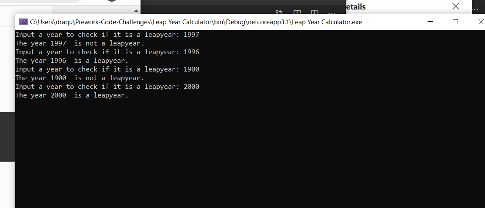

# Prework-Code-Challenges For 401
### Written by Daniel Rogahn
## Challenge 1 -- Array Max Result:
To create an app that takes in the five numbers to be contained in an array one character at a time and display it.  
Next the app is to take in a user input and for each number of the array gain that many points equal to the number for each instance of that number occuring in the array and output the score.

#### Live Screenshot:

## Challenge 2 -- Leap Year Calculator:
To create an app that takes a year as input and tells you if it is a leapyear or not based on the rules:
A leap year occurs every year that is divisible by four except for every year evenly divisible by 100 unless the year is also evenly divisible by 400.

#### Live Screenshot:

